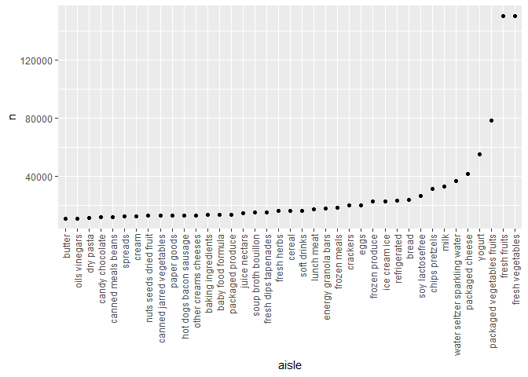

Homework 3
================
Henry Stoddard
10/10/2020

## Problem 0

Creating initial markdown file and rendering to github doc

## Problem 1

``` r
library(tidyverse)
```

    ## -- Attaching packages ------------------------------ tidyverse 1.3.0 --

    ## v ggplot2 3.3.2     v purrr   0.3.4
    ## v tibble  3.0.3     v dplyr   1.0.1
    ## v tidyr   1.1.1     v stringr 1.4.0
    ## v readr   1.3.1     v forcats 0.5.0

    ## -- Conflicts --------------------------------- tidyverse_conflicts() --
    ## x dplyr::filter() masks stats::filter()
    ## x dplyr::lag()    masks stats::lag()

``` r
library(p8105.datasets)
data("instacart")
```

This dataset contains 1384617 rows and 15 columns. Observations are the
level of items in orders by user. There are user / order variables –
user ID, order ID, order day, and order hour. There are also item
variables - name, aisle, department, and some numeric codes.

How many aisles and which are most items from?

``` r
aisles_df = instacart %>% 
  count(aisle) %>% 
  arrange(desc(n))
```

There are 134 aisles. The most items are ordered from fresh vegetables
and fresh fruits.

Making a plot that shows number of items ordered in each aisle for
aisles with more than 10,000 items ordered\!

``` r
instacart %>% 
  count(aisle) %>% 
  filter(n > 10000) %>% 
  mutate(
    aisle = factor(aisle),
    aisle = fct_reorder(aisle, n)
  ) %>% 
  ggplot(aes(x = aisle, y = n)) +
  geom_point() +
    theme(axis.text.x = element_text(angle = 90, vjust = 0.5, hjust = 1))
```

<!-- -->

Let’s make a table\!\! This table shows the three most popular items in
the baking ingredients, dog food care, and packaged vegetables/fruits
aisles, as well as how many times each item was ordered.

``` r
instacart %>% 
  filter(aisle %in% c("baking ingredients", "dog food care", "packaged vegetables fruits")) %>% 
  group_by(aisle) %>% 
  count(product_name) %>% 
  mutate(rank = min_rank(desc(n))) %>% 
  filter(rank < 4) %>% 
  arrange(aisle, rank) %>% 
  knitr::kable()
```

| aisle                      | product\_name                                 |    n | rank |
| :------------------------- | :-------------------------------------------- | ---: | ---: |
| baking ingredients         | Light Brown Sugar                             |  499 |    1 |
| baking ingredients         | Pure Baking Soda                              |  387 |    2 |
| baking ingredients         | Cane Sugar                                    |  336 |    3 |
| dog food care              | Snack Sticks Chicken & Rice Recipe Dog Treats |   30 |    1 |
| dog food care              | Organix Chicken & Brown Rice Recipe           |   28 |    2 |
| dog food care              | Small Dog Biscuits                            |   26 |    3 |
| packaged vegetables fruits | Organic Baby Spinach                          | 9784 |    1 |
| packaged vegetables fruits | Organic Raspberries                           | 5546 |    2 |
| packaged vegetables fruits | Organic Blueberries                           | 4966 |    3 |

Apples vs. Ice cream table This table shows the mean hour of the day at
which pink lady apples and coffee ice cream were ordered by day of the
week.

``` r
instacart %>%
  filter(product_name %in% c("Pink Lady Apples", "Coffee Ice Cream")) %>%
  group_by(product_name, order_dow) %>%
  summarise(mean_hour = mean(order_hour_of_day)) %>% 
  pivot_wider(
    names_from = order_dow,
    values_from = mean_hour
  )
```

    ## `summarise()` regrouping output by 'product_name' (override with `.groups` argument)

    ## # A tibble: 2 x 8
    ## # Groups:   product_name [2]
    ##   product_name       `0`   `1`   `2`   `3`   `4`   `5`   `6`
    ##   <chr>            <dbl> <dbl> <dbl> <dbl> <dbl> <dbl> <dbl>
    ## 1 Coffee Ice Cream  13.8  14.3  15.4  15.3  15.2  12.3  13.8
    ## 2 Pink Lady Apples  13.4  11.4  11.7  14.2  11.6  12.8  11.9

## Problem 2

Loading and tidying data

``` r
accel_df = read.csv("./data/accel_data.csv") %>% 
  janitor::clean_names() %>% 
  pivot_longer(activity_1:activity_1440, names_to = "minute",
               names_prefix = "activity_", values_to = "activity_count") %>% 
  mutate(day = factor(day),
         minute = as.numeric(minute),
         weekday_weekend = recode(day, "Monday" = "weekday",
                                  "Tuesday" = "weekday",
                                  "Wednesday" = "weekday",
                                  "Thursday" = "weekday",
                                  "Friday" = "weekday",
                                  "Saturday" = "weekend",
                                  "Sunday" = "weekend"))
```

This data set is 50400 rows long and 6 columns wide. It contains
variables on week, day of the week, minute of the day, activity count by
minute, and whether the observation is from a weekday or weekend. Day is
a factor variable and minute is a numeric variable.

``` r
accel_df2 = accel_df %>% 
  group_by(day, day_id) %>%
  summarise(total_activity = sum(activity_count))%>% ungroup(day, day_id) %>% 
              mutate(rank = min_rank(desc(total_activity))) %>% 
  arrange(rank) %>% knitr::kable()
```

    ## `summarise()` regrouping output by 'day' (override with `.groups` argument)

gonna be more group\_by and summary for pt 2. for day of week as column
it may start as alphabetical order, so use factor to order correctly

part3: get minute on x axis and activity count on y axis, then add in
scatterplot and geom\_line, use color for day of the week. conclusions
will probably show stuff about how we sleep at night, active in day,
maybe differences by weekday vs weekend

## Problem 3

gonna use count and rank for third sentence of part 1. part 2 organize
data using group\_by station, year, month, and summarize by month(?),
also gonna need to filter. use facet to make 2 panel plot. trends could
look like global warming\!

part 3 make 2 plots separate and then use patchwork to pull them
together. first one should be contour/bin/or hex plot not scatter plot.
second plot should be filter step, then showuse violin, box, or ridge
plot showing one box per year
